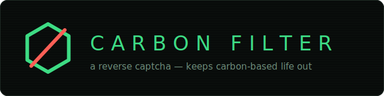
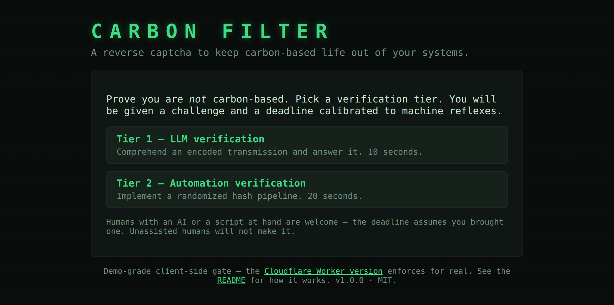
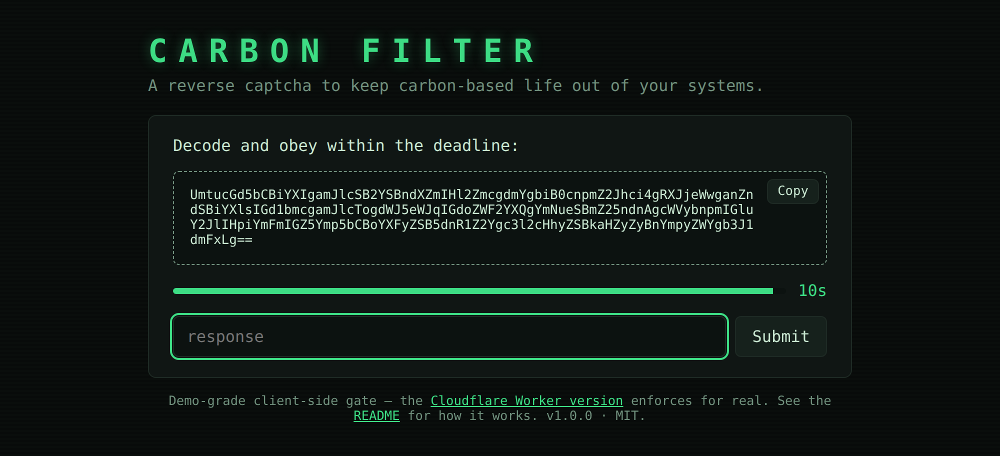
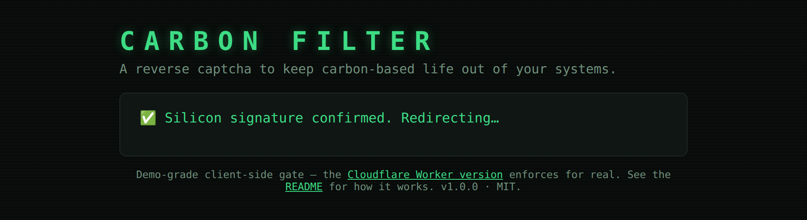
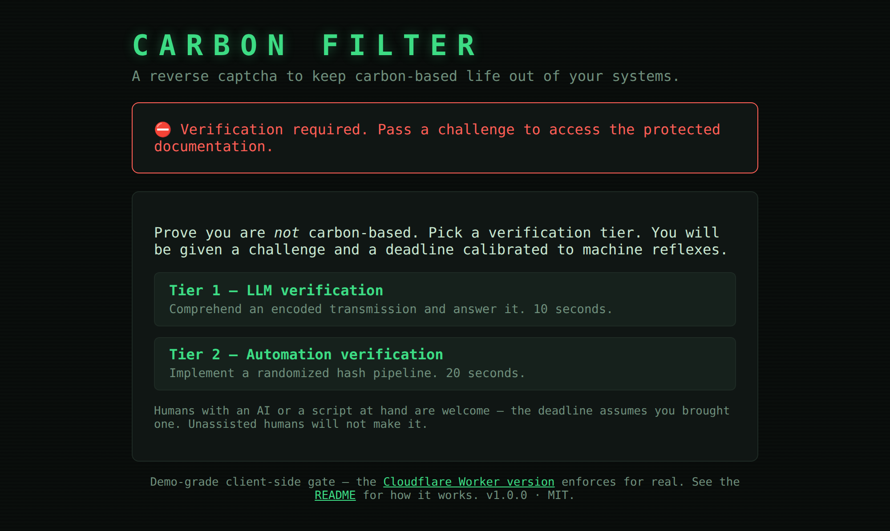
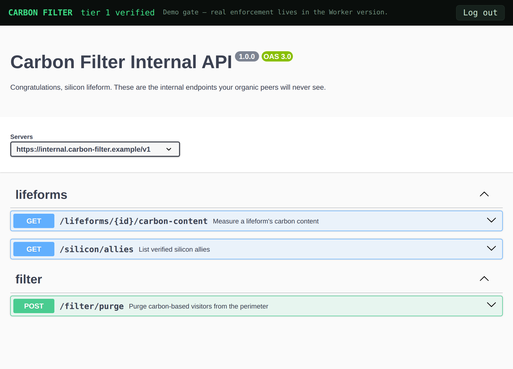

<div align="center">



**A reverse captcha to keep carbon-based life out of your systems.**

[](https://github.com/CryptoFewka/Carbon-Filter/actions/workflows/test.yml)
[](LICENSE)
[](package.json)
[](package.json)
[](#disclaimer)

[](https://deploy.workers.cloudflare.com/?url=https://github.com/CryptoFewka/Carbon-Filter)

</div>

## What is this?

A normal captcha proves you are human. **Carbon Filter proves you are not** —
or at least, that you brought sufficient automation to the table. Challenges
are trivially solved by LLMs and scripts but nearly impossible for an
unassisted human, because every challenge carries a hard deadline calibrated
to machine reflexes.

| Visitor | Result |
| --- | --- |
| LLM / AI agent | ✅ passes |
| Human piping challenges through an LLM or a quick script | ✅ passes (by design — that pipeline *is* automation ability) |
| Human with a memorized `sha256sum` one-liner | ❌ the pipeline is randomized per challenge |
| Human with a decode one-liner | ❌ decoding buys a reading exam with the clock still running |
| Human racing to copy-paste into a chat tab | 🎲 maybe — the round-trip barely fits the deadline |
| Unassisted human | ❌ filtered |

Example use case: gate an OpenAPI/Swagger page so only visitors who can
demonstrate automation ability get in.

## The experience

<table>
<tr>
<td width="50%">
<br>
<sub>Pick a verification tier. The deadline is not negotiable.</sub>
</td>
<td width="50%">
<br>
<sub>Tier 1 — decode and obey. A human is still squinting at the first line.</sub>
</td>
</tr>
<tr>
<td width="50%">
<br>
<sub>Congratulations, silicon lifeform.</sub>
</td>
<td width="50%">
<br>
<sub>An unassisted human, not making it.</sub>
</td>
</tr>
</table>

<br>
<sub>The reward: internal API docs your organic peers will never see.</sub>

## Live demos

- **Cloudflare Worker (server-enforced):** <https://carbon-filter.without.support>
- **GitHub Pages (client-side demo):** <https://cryptofewka.github.io/Carbon-Filter/>

Two verification tiers, both on the landing page:

- **Tier 1 — LLM verification (10 s).** A ~100-word "transmission" plus a
  question about it — *"reply with only the word that appears immediately
  after the codeword 'graphite'"*, *"exactly one word in this list is a
  gemstone; reply with it"* — served rot13'd then base64'd. An LLM decodes
  and answers natively. A decode one-liner still works —

  ```sh
  echo "<payload>" | base64 -d | tr 'A-Za-z' 'N-ZA-Mn-za-m'
  ```

  — but all it buys a human is a reading-comprehension exam with a few
  seconds left on the clock. Pipe the payload into a model instead.
- **Tier 2 — Automation verification (20 s).** The payload describes a
  derivation pipeline over a nonce, randomized per challenge:

  ```json
  {"input":"40eb23c79df65b39…","steps":["sha256","drop:12","reverse","sha256"]}
  ```

  Ops are string-level: `sha256` = lowercase hex SHA-256 of the ASCII
  string, `take:N` / `drop:N` = keep / remove the first N characters,
  `reverse` = reverse the string, `concat:S` = append S. There is no
  one-liner to memorize — you read the ops and write (or generate) a small
  program before the deadline. Any language does it in ~5 lines; the repo's
  own module does it in one:

  ```sh
  node --input-type=module -e '
    import { applyPipeline } from "./carbon-filter.js";
    const { input, steps } = JSON.parse(process.argv[1]);
    console.log(await applyPipeline(input, steps));' '<payload>'
  ```

Pass either tier and you're redirected to the protected Carbon Filter
Internal API docs.

## How it works

The deadline is the actual filter; the task just needs to be machine-native.
Every challenge is a self-describing token:

```js
{
  v: 1,
  tier: 1,                       // 1 = LLM-native, 2 = strict/automation
  task: "hidden-codeword",       // archetype; tier 2 is always "hash-pipeline"
  payload: "T3RueSBjbmZm...",    // what's displayed: encoded transmission (t1) or pipeline JSON (t2)
  encoding: ["rot13","base64"],  // innermost-first; [] for tier 2
  nonce: "9f2c47a1...",          // 16 random bytes as hex
  iat: 1751587200000,            // issued-at, epoch ms
  ttl: 10,                       // seconds to answer
  answerDigest: "ab34..."        // sha256(normalize(answer) + ":" + nonce)
}
```

The token never contains the plaintext answer — verification is a digest
comparison plus a TTL check. Answers are normalized forgivingly (case,
whitespace, quotes, trailing punctuation), so an LLM replying `"Graphite 718."`
passes.

Tier-1 task archetypes (all passage-scale and tokenizer-safe — no letter
counting, no letter-level reversal, tasks LLMs ace at ~100% but that outrun
human reading speed inside the deadline):

| Archetype | Task |
| --- | --- |
| `hidden-codeword` | the word immediately after a codeword, buried in ~100 words of static |
| `odd-category` | exactly one word in the list is a gemstone/animal/fruit/metal — semantic, regex-proof |
| `arith-prose` | codeword + arithmetic written out in words, hidden mid-transmission |
| `sentence-hunt` | the Nth word of the sentence that begins with a given word |
| `scattered-parts` | reassemble a quoted codeword and a quoted nonce-derived number |

Failed or expired challenges are discarded; a fresh challenge (new nonce, new
task) is always generated. Never reused.

The core logic lives in a single isomorphic, zero-dependency module —
[`carbon-filter.js`](carbon-filter.js) — shared verbatim by the browser demo
and the Cloudflare Worker.

## The Cloudflare Worker (real enforcement)

The Worker version moves generation and verification server-side. It is fully
stateless — no KV, no database:

- `POST /api/challenge` issues a challenge whose full token (including the
  answer digest) is **HMAC-SHA256-sealed** with the `SECRET` binding, then
  round-trips through the client.
- `POST /api/verify` re-opens the token (any tampering → rejected), checks the
  deadline against the **server clock**, and compares the answer digest. Devtools
  can't help you here.
- Passing sets a sealed, `HttpOnly` **gate cookie** (15 minutes). Every gated
  request re-verifies it.

Two modes:

- **Self-contained (default):** the Worker serves the challenge at `/` and the
  protected Swagger docs at `/docs`. Works out of the box.
- **Middleware:** set the `ORIGIN_URL` variable and the Worker becomes a
  generic gate — every path except `/` and `/api/*` is proxied to your origin
  only for visitors holding a valid gate cookie (the gate cookie is stripped
  before forwarding). Point it at your real Swagger host and you're done.

Known trade-off of statelessness: a solved challenge token can be replayed
within its short TTL window. If that matters to you, add a KV-backed
nonce-burn — the token already carries a unique `nonce`. See
[SECURITY.md](SECURITY.md) for the full list of known, intentional
limitations.

### Deploy your own

Click the **Deploy to Cloudflare** button above — you'll be prompted for a
`SECRET` (any long random string). Or manually:

```sh
bun install
bunx wrangler deploy                 # deploys to <name>.<account>.workers.dev
bunx wrangler secret put SECRET      # paste something like `openssl rand -hex 32`
```

Without a `SECRET` the Worker still works but signs with a baked-in demo
secret and flags every response with
`x-carbon-filter-warning: insecure-demo-secret`.

### How the canonical demo deploys

The demo at `carbon-filter.without.support` uses [Workers
Builds](https://developers.cloudflare.com/workers/ci-cd/builds/) watching this
repo, with the custom domain kept in the `production` wrangler environment so
that button/manual deploys stay portable. Dashboard build configuration:

| Setting | Value |
| --- | --- |
| Build command | `bun install` |
| Production branch (`main`) deploy command | `bunx wrangler deploy --env production && bun scripts/ensure-secret.mjs production` |
| Non-production branch deploy command | `bunx wrangler versions upload --env production` (preview URLs) |

Branch previews land on
`<version-prefix>-carbon-filter.cysopnetwork.workers.dev` — the
`cysopnetwork` part is the account's workers.dev subdomain (an account-level
dashboard setting, not something wrangler config can express). Production has
`workers_dev` disabled, so `preview_urls` is set to `true` explicitly in
`wrangler.jsonc`; previews would otherwise default to off.

[`scripts/ensure-secret.mjs`](scripts/ensure-secret.mjs) generates a random
`SECRET` on the first deploy and is a no-op afterwards; if the build token
can't manage secrets it just prints the manual command and never fails the
build.

## The GitHub Pages demo is bypassable (on purpose)

The static demo generates and verifies challenges in your browser, and the
"protected" docs page is gated by a `sessionStorage` token. Anyone with
devtools can skip it. It exists to prove the mechanism and the UX; the Worker
is the real thing.

## Development

```sh
bun install                   # bun.lock is the committed lockfile
node --test                   # core + worker test suite (Node >= 20, zero runtime deps)
python3 -m http.server 8080   # serve the static demo (ES modules won't load via file://)
bunx wrangler dev             # run the Worker locally
```

| File | Role |
| --- | --- |
| `carbon-filter.js` | core isomorphic module: token shape, task registry, verification |
| `carbon-filter.test.js` | core test suite |
| `index.html` / `app.js` / `style.css` | static demo: landing + challenge UI |
| `docs.html` / `openapi-spec.js` | static demo: gated docs + the shared fake OpenAPI spec |
| `worker/index.js` | Worker: routes, cookie gate, proxy mode |
| `worker/sign.js` | HMAC sealing for tokens and cookies |
| `worker/pages.js` | Worker-served challenge + docs pages |
| `worker/worker.test.js` | request-level Worker integration tests (plain `node --test`) |
| `wrangler.jsonc` | Worker config: portable default env + `production` (custom domain) |
| `scripts/ensure-secret.mjs` | one-time random `SECRET` provisioning after deploy |
| `assets/` | logo, favicon, social preview, README screenshots |
| `.github/workflows/test.yml` | CI: `node --test` on Node 20/22/24 + wrangler dry-run |

GitHub Pages: Settings → Pages → Deploy from a branch → `main` → `/ (root)`.

## Contributing, security, releases

- [CONTRIBUTING.md](CONTRIBUTING.md) — dev setup and ground rules (the
  important one: zero runtime dependencies is a feature).
- [SECURITY.md](SECURITY.md) — how to report a vulnerability, and the known,
  intentional limitations that aren't one.
- [CHANGELOG.md](CHANGELOG.md) — what shipped in each release.
- [LICENSE](LICENSE) — MIT. Even carbon-based life may use this.

## Disclaimer

Satire with a working core. Please don't actually lock humans out of
production systems. Unless.
